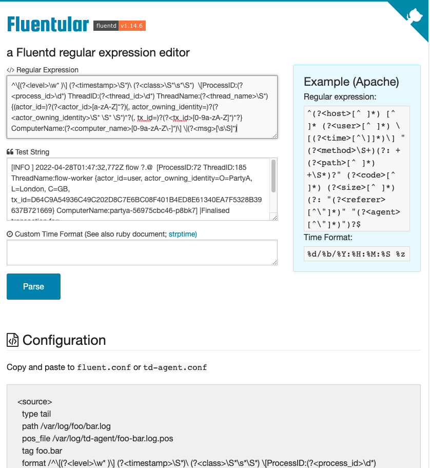
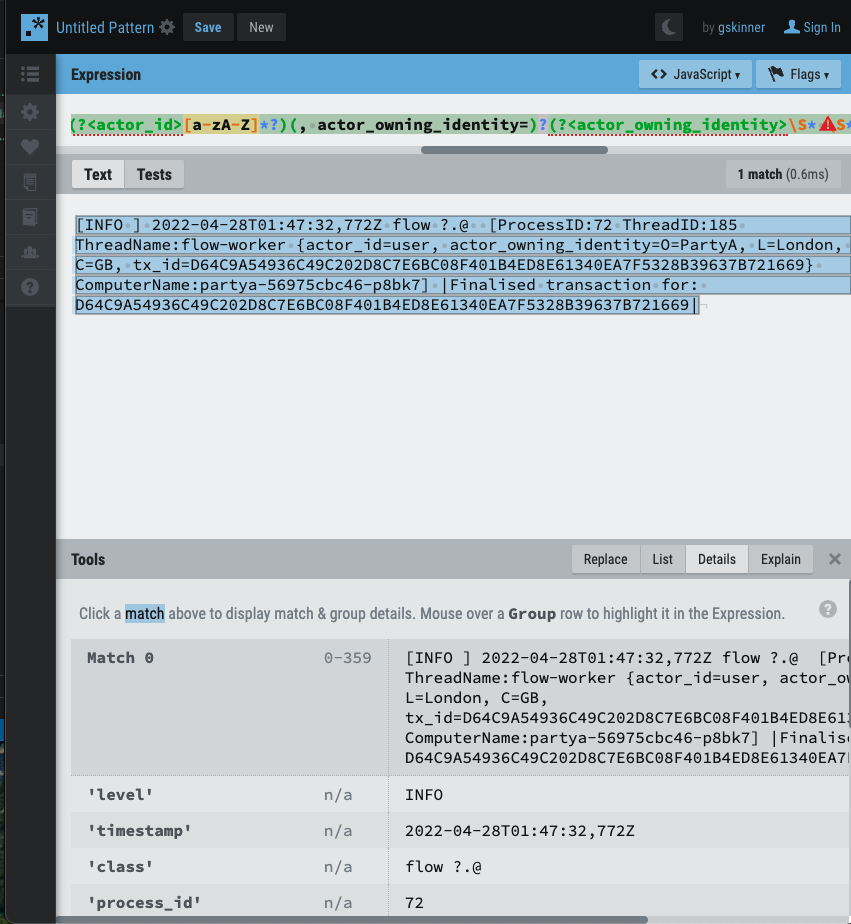

This documents show how to use fluentd-ui for testing online fluentd configuration 


 # Get the code and build an image
 ```
 git clone https://github.com/fluent/fluentd-ui.git
 cd fluentd-ui
 docker build -t fluent/fluentd-ui:1.0.0 .
 docker-compose -f ./docker-compose.yaml up -d
 docker-compose -f ./docker-compose.yaml down 
 ```

The url is http://localhost:9292/
user: admin111
pw: changeme


# get the logs from kubernetes
```
k -n corda logs -l app=partya > partya.log
```

# send the logs
```
docker cp partya.log fluend-ui:/var/log/input/partya.log
docker cp my.log fluentd-ui:/var/log/input/partya.log
```

# Parse testing
[Fluent Parser](https://fluentular.herokuapp.com/)


[build regex](https://regexr.com/)

```
[INFO ] 2022-04-28T00:10:28,029Z flow ?.@  [ProcessID:70 ThreadID:179 ThreadName:flow-worker {actor_id=user, actor_owning_identity=O=PartyA, L=London, C=GB, tx_id=3CDC4B9176D7D8B5C900FC4BB95BCD829CFEE87BAB42073474FF871C859AB1EB} ComputerName:partya-56975cbc46-7dm9m] |Finalised transaction for: 3CDC4B9176D7D8B5C900FC4BB95BCD829CFEE87BAB42073474FF871C859AB1EB|
```

# pattern
```
^\[(?<level>\w* )\] (?<timestamp>\S*)\ (?<class>\S*\s*\S*)  \[ProcessID:(?<process_id>\d*) ThreadID:(?<thread_id>\d*) ThreadName:(?<thread_name>\S*) {(actor_id=)?(?<actor_id>[a-zA-Z]*?)(, actor_owning_identity=)?(?<actor_owning_identity>\S* \S* \S*)*?(, tx_id=)?(?<tx_id>[0-9a-zA-Z]*)*?} ComputerName:(?<computer_name>[0-9a-zA-Z\-]*)\] \|(?<msg>[\s\S]*)\|
```

# Config tested
```
<source>
  @type tail
  path /var/log/partya.log
  tag corda
  pos_file /tmp/fluentd--B651162926.pos
  <parse>
    @type regexp
    expression /^\[(?<level>\w* )\] (?<timestamp>\S*)\ (?<class>\S*\s*\S*)  \[ProcessID:(?<process_id>\d*) ThreadID:(?<thread_id>\d*) ThreadName:(?<thread_name>\S*) {(actor_id=)?(?<actor_id>[a-zA-Z]*?)(, actor_owning_identity=)?(?<actor_owning_identity>\S* \S* \S*)*?(, tx_id=)?(?<tx_id>[0-9a-zA-Z]*)*?} ComputerName:(?<computer_name>[0-9a-zA-Z\-]*)\] \|(?<msg>[\s\S]*)\|/im
  </parse>  
</source>

#<match **>
#  @type stdout
#</match>

<match **>
  @type file
  path /var/log/output
  <buffer>
  	timekey_wait 5m
    timekey 86400
    timekey_use_utc true
    path /var/log/output/logs.*    
  </buffer>
  append true
</match>
```

Logging in Action samples
[get the code](https://github.com/mp3monster/LoggingInActionWithFluentd)