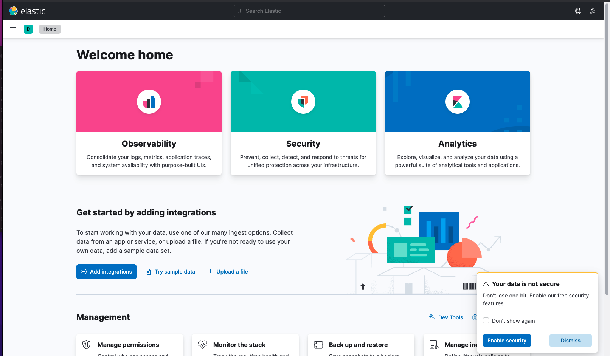
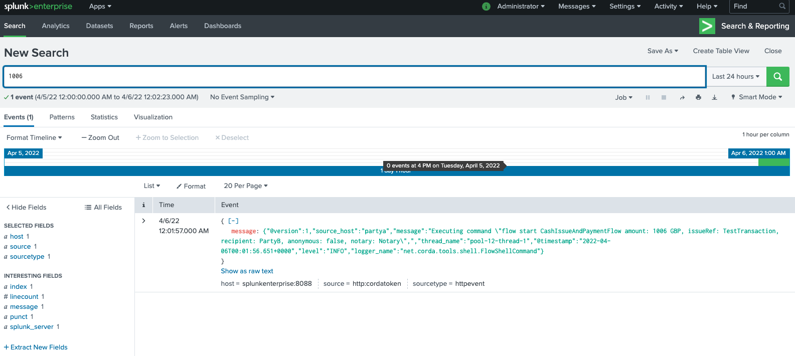
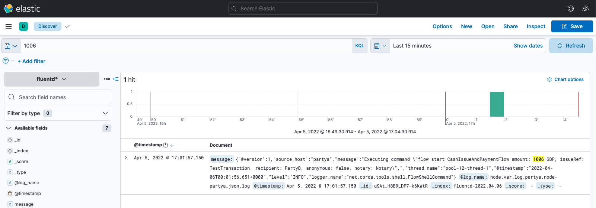

# Fluentd

This folder adds Fluentd + Splunk + Elastic

Make sure run the steps ./07_add-trace.sh and do the following
1. Copy the folder fluentd into ./mynetwork folder
2. Copy the folder prometheus into ./mynetwork folder
3. copy the file docker-compose-fluent-prometheus-splunk.yml into ./mynetwork foder
4. To start run commamnd **`docker compose -f mynetwork/docker-compose-fluent-prometheus-splunk.yml up -d`**
5. To stop run command **`docker compose -f mynetwork/docker-compose-fluent-prometheus-splunk.yml down`**


Corda nodes have similar configuration
```
    links:
      - fluentd
    logging:
      driver: fluentd
      options:
        fluentd-address: 0.0.0.0:24224
        tag: notarylog
```

Container for fluentd
```
  fluentd:
    build: ./fluentd
    hostname: fluentd
    container_name: Fluentd
    ports:
      - '24224:24224'
    volumes:
      - ./fluentd/fluent.conf:/fluentd/etc/fluent.conf
      - ./partya/logs:/var/log/partya:ro
      - ./partyb/logs:/var/log/partyb:ro
      - ./notary/logs:/var/log/notary:ro   
    depends_on:
      - elasticsearch
      - splunkenterprise
```

fluentd.conf file

Either the source is captured by the port forward or the source files
```
<source>
    @type forward
    port 24224
    bind 0.0.0.0
</source>
<source>
  @type tail
  path /var/log/partya/node-partya_json.log,/var/log/partyb/node-partyb_json.log,/var/log/notary/node-notary_json.log   
  pos_file /var/log/fluentd/logs.log.pos
  time_format "%Y-%m-%dT%H:%M:%S.%L%Z"
  tag node.*
  read_from_head true
  format none
</source>
# <match **>
#     @type file
#     path /var/log/fluent/node
#     <buffer time>
#       timekey_wait 5m
#       timekey 86400
#       timekey_use_utc true
#       path /var/log/fluent/node/logs.*
#     </buffer>
#     append true
#  </match>
#  <match **>
#     @type splunk_hec
#     host  splunkenterprise
#     port  8088
#     token 9eac125e-17c6-4c90-aae9-f3c1e7d7a7c8
#     output_format json
#     enableSSL 0
#     #ssl_version     TLSv1_3
#     <buffer>
#         @type memory
#         flush_mode  interval
#         flush_interval  2
#         flush_thread_count  2
#         overflow_action block
#         retry_forever true
#     </buffer>
# </match>
#  <match **>
#     @type splunk_hec
#     hec_host splunkenterprise
#     hec_port 9997
#     hec_token 00000000-0000-0000-0000-000000000000
#     output_format json
# </match>
 <match **>
# <match docker.*.*>
  @type copy
  <store>
    @type elasticsearch
    host elasticsearch
    port 9200
    logstash_format true
    logstash_prefix fluentd
    logstash_dateformat %Y.%m.%d
    include_tag_key true
    type_name access_log
    tag_key @log_name
    <buffer>
      flush_interval 1s
      flush_thread_count 2
    </buffer>
  </store>
  <store>
    @type splunk_hec
    host  splunkenterprise
    port  8088
    token 9eac125e-17c6-4c90-aae9-f3c1e7d7a7c8
    output_format json
    enableSSL 0
    #ssl_version     TLSv1_3
    <buffer>
        @type memory
        flush_mode  interval
        flush_interval  2
        flush_thread_count  2
        overflow_action block
        retry_forever true
    </buffer>  
  </store>
</match>
```

# Splunk
## Splunk Login
for the login use admin/password for the url http://localhost:8000/


## Splunk Settings


## Splunk Data Inputs


## Splunk HTTP Event Collector


# Elastic

Elastic url is http://localhost:5601/

## Elastic - Landing Page


## Elastic - Data View


## Elastic - Create Data View


## Elsatik - Stack Management Data View


## Step 10: Run some Corda Finance flows

SSH into the PartyA node Crash shell:

```bash
ssh -o UserKnownHostsFile=/dev/null -o StrictHostKeyChecking=no user@localhost -p 2222
```

When prompted, the password is `password`.

You should see the following in your terminal:

```bash
Welcome to the Corda interactive shell.
You can see the available commands by typing 'help'.

Mon Jun 15 07:52:13 GMT 2020>>>
```

Let's execute a `CashIssueAndPaymentFlow`:
flow start CashIssueAndPaymentFlow amount: 1006 GBP, issueRef: TestTransaction, recipient: PartyB, anonymous: false, notary: Notary
```bash

```

```bash
Mon Jun 15 07:53:52 GMT 2020>>> flow start CashIssueAndPaymentFlow amount: 1000 GBP, issueRef: TestTransaction, recipient: PartyB, anonymous: false, notary: Notary

 ✓ Starting
 ✓ Issuing cash
          Generating anonymous identities
     ✓ Generating transaction
     ✓ Signing transaction
     ✓ Finalising transaction
              Requesting signature by notary service
                  Requesting signature by Notary service
                  Validating response from Notary service
         ✓ Broadcasting transaction to participants
 ✓ Paying recipient
     ✓ Generating anonymous identities
     ✓ Generating transaction
     ✓ Signing transaction
     ✓ Finalising transaction
         ✓ Requesting signature by notary service
             ✓ Requesting signature by Notary service
             ✓ Validating response from Notary service
         ✓ Broadcasting transaction to participants
▶︎ Done
Flow completed with result: Result(stx=SignedTransaction(id=FB08662B2E0A19ECF9B0E3E44D2DF25934F9576DBF262D794EE2C795C3269503), recipient=O=PartyB, L=London, C=GB)
```

## Elastic Search


## Splunk Search
